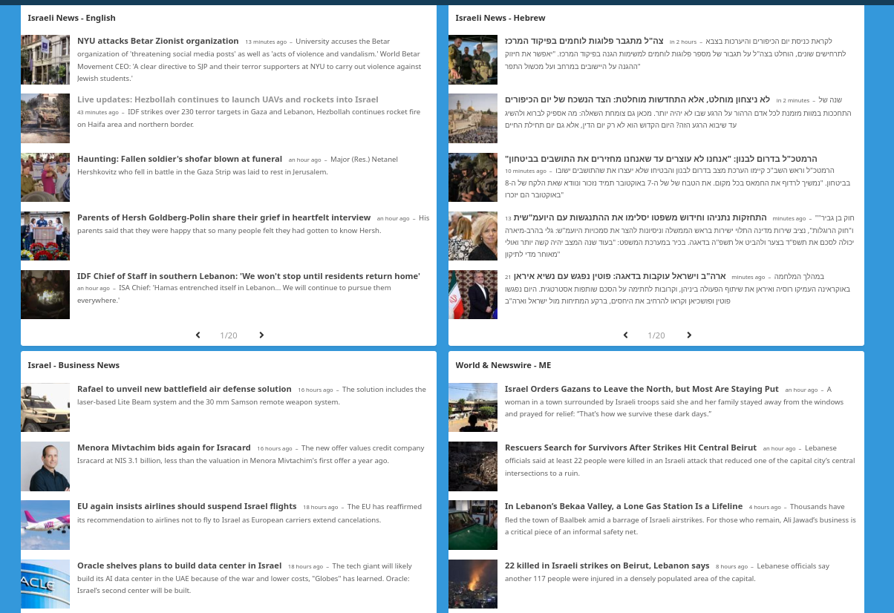

# Israeli News Links & RSS Feeds

## Purpose Statement

The purpose of this repository is to aggregate a collection of links which may be useful for those wishing to monitor ongoing news developments in Israel.

I assembled this collection of links for my own preparedness (I live in Israel!) in order to create a few monitoring dashboards to run 24/7. My sole motivation in open-sourcing this small link bundle is to help others to do the same and to save myself from having to fish out the same links repeatedly.

The selection of sources is often guided by asking *"who still provides an RSS feed in the year 2024?"* and doesn't always reflect my own political alignments. 

## Exclusions

Telegram groups whose links are not in the public domain.

## Dashboards

## Use Case Statement

## Author

Daniel Rosehill  
(public at danielrosehill dot com)

## Licensing

This repository is licensed under CC-BY-4.0 (Attribution 4.0 International) 
[License](https://creativecommons.org/licenses/by/4.0/)

### Summary of the License
The Creative Commons Attribution 4.0 International (CC BY 4.0) license allows others to:
- **Share**: Copy and redistribute the material in any medium or format.
- **Adapt**: Remix, transform, and build upon the material for any purpose, even commercially.

The licensor cannot revoke these freedoms as long as you follow the license terms.

#### License Terms
- **Attribution**: You must give appropriate credit, provide a link to the license, and indicate if changes were made. You may do so in any reasonable manner, but not in any way that suggests the licensor endorses you or your use.
- **No additional restrictions**: You may not apply legal terms or technological measures that legally restrict others from doing anything the license permits.

For the full legal code, please visit the [Creative Commons website](https://creativecommons.org/licenses/by/4.0/legalcode).